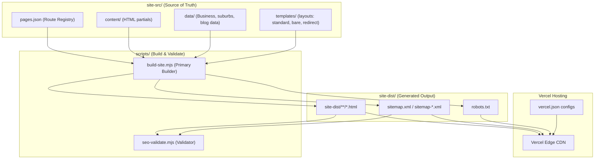

# ZQ Removals Project Guidelines

This project is a generator-driven static site for `zqremovals.au`. The build process compiles templates, content partials, and JSON-LD schema into a static distribution deployed on Vercel.

---

## When to Use
Reference this skill when making modifications to routes, page copy, internal links, schemas, redirects, templates, or sitemaps within this repository. Always follow the guidelines herein to prevent SEO regressions and build failures.

---

## Architecture Overview

**Tech Stack:**
- **Static Site Engine**: Astro 6.x and a custom Node.js runner ([build-site.mjs](file:///C:/Users/abuba/zq/scripts/build-site.mjs))
- **Styling**: Tailwind CSS v4.x + LightningCSS (for CSS transform and minification)
- **Bundler**: Esbuild (for packing client-side script and styles)
- **Runtime Environment**: Node.js 22.x
- **Hosting / CDN**: Vercel (production redirects, rewrite routing, security headers)
- **Validation**: Playwright (E2E & visual checking) + native Node.js test runner (`node --test`)

**Data Flow:**


---

## File Structure

```
zq/
├── site-src/                 # Source of truth files
│   ├── pages.json            # Route registry mapping paths to layouts & content
│   ├── content/              # Route content partials (most page copy changes go here)
│   ├── partials/             # Shared HTML blocks (headers, footers, CTAs, forms)
│   ├── templates/            # HTML templates for page layouts (standard, bare, redirect)
│   └── data/                 # Static data and helper scripts
│       ├── seo-v4.mjs        # Core SEO config, schema builders, and internal link logic
│       ├── business.mjs      # Contact details, schema info, and identity metadata
│       ├── zq-suburbs.mjs    # Suburb coordinates and geodata
│       ├── zq-services.mjs   # Core moving service profiles
│       ├── zq-blog-guides.mjs# Guide articles metadata
│       └── zq-internal-links.mjs # Predefined geographic and contextual internal linking profiles
│
├── scripts/                  # Build automation and diagnostic runners
│   ├── build-site.mjs        # Main generator compiler
│   └── seo-validate.mjs      # Checks links, sitemaps, canonicals, and noindex tags
│
├── site-dist/                # Generated distribution files (NEVER edit directly)
│   ├── index.html            # Compiled home page
│   ├── sitemap.xml           # Sitemap index
│   └── robots.txt            # Crawl instructions
│
├── tests/                    # Core regression test suite
│   ├── search-console-fixes.test.mjs # Regression checks for search console issues
│   ├── seo-conversion-pass.test.mjs  # Checks for CTAs and conversion paths
│   └── eeat-audit.test.mjs   # Asserts E-E-A-T criteria compliance
│
├── vercel.json               # Deploy-layer routing, HSTS headers, redirects
├── package.json              # NPM dependencies and scripts
└── AGENTS.md                 # Original Codex rules and development parameters
```

---

## Code Patterns

### Route Registry Definition ([pages.json](file:///C:/Users/abuba/zq/site-src/pages.json))

All pages must be defined in the route registry. Standard pages compile down to directories with index files (e.g. `output: "removalists-glenelg/index.html"` or `output: "removalists-glenelg.html"` which compiles to `removalists-glenelg/index.html`).

```json
  {
    "output": "removalists-adelaide-cbd.html",
    "layout": "standard",
    "title": "Best Removalists Adelaide CBD | ZQ Removals",
    "description": "Professional house and apartment removalists in Adelaide CBD. Call ZQ Removals for tight-access street loading and experienced CBD moving services.",
    "canonical": "https://zqremovals.au/removalists-adelaide-cbd/",
    "robots": "index,follow",
    "themeColor": "#0A192F",
    "ogTitle": "Removalists Adelaide CBD | ZQ Removals",
    "ogDescription": "Professional house and apartment removalists in Adelaide CBD.",
    "ogType": "website",
    "ogUrl": "https://zqremovals.au/removalists-adelaide-cbd/",
    "ogImage": "https://zqremovals.au/zq-removals-social-share.webp",
    "twitterCard": "summary_large_image",
    "jsonLd": [
      {
        "type": "MovingCompany",
        "name": "ZQ Removals Adelaide CBD",
        "description": "Reliable local movers in the central business district."
      }
    ],
    "contentFile": "content/suburbs/adelaide-cbd.html"
  }
```

### Redirect Definition ([pages.json](file:///C:/Users/abuba/zq/site-src/pages.json))

Legacy crawlable aliases are mapped as redirects inside `pages.json` to keep them clean for crawlers. They must have `"layout": "redirect"`, be set to `"noindex,nofollow"`, and specify a meta `refresh` property.

```json
  {
    "output": "adelaide-cbd.html",
    "layout": "redirect",
    "title": "Adelaide CBD Removalists | Redirecting to Canonical Page",
    "description": "This legacy Adelaide CBD URL now redirects to the canonical page.",
    "canonical": "https://zqremovals.au/removalists-adelaide-cbd/",
    "robots": "noindex,nofollow",
    "refresh": "0; url=/removalists-adelaide-cbd/",
    "contentFile": "content/legacy-redirects/adelaide-cbd.html"
  }
```

### Internal Linking Clusters ([zq-internal-links.mjs](file:///C:/Users/abuba/zq/site-src/data/zq-internal-links.mjs))

Internal link clustering helps maintain domain authority flow. Sibling pages, geographic hubs, related services, and pre-quote planning guides are linked dynamically:

```javascript
export const zqServiceLinkProfiles = {
  'furniture-removals-adelaide': {
    services: [
      { href: '/removalists-adelaide/', label: 'trusted removalists in Adelaide' },
      { href: '/furniture-removalists-adelaide/', label: 'furniture removalists Adelaide' }
    ],
    suburbs: [
      { href: '/removalists-glenelg/', label: 'Glenelg furniture access' },
      { href: '/removalists-norwood/', label: 'Norwood tight-entry moves' }
    ],
    guides: [
      { href: '/adelaide-moving-guides/furniture-protection-guide-adelaide/', label: 'prepare furniture for moving' }
    ],
    siblings: [
      { href: '/apartment-removals-adelaide/', label: 'apartment removals Adelaide' }
    ]
  }
};
```

---

## Testing Requirements

You must run tests locally to prevent shipping syntax errors or breaking indexing layouts. The repository utilizes the native Node.js test runner.

```bash
# Run all tests (API smoke tests + Node unit tests)
npm test

# Run focused SEO regression tests
node --test tests/search-console-fixes.test.mjs

# Run conversion tests (verifies CTA forms and landing copy)
node --test tests/seo-conversion-pass.test.mjs

# Run E-E-A-T validation (checks schema, locations, and compliance copy)
node --test tests/eeat-audit.test.mjs

# Run Playwright visual mobile checks
npm run test:visual-mobile
```

---

## Deployment Workflow

### Pre-Deployment Checklist

- [ ] Execute `npm run build` locally and ensure it completes without native compiler/optional package errors.
- [ ] Run `npm run seo:validate` (or `node scripts/seo-validate.mjs`) to verify sitemaps, robots.txt, canonical integrity, and check for broken internal links.
- [ ] Ensure all test scripts pass (`npm test`).
- [ ] Verify that any modified redirect paths are added to [vercel.json](file:///C:/Users/abuba/zq/vercel.json) as permanent redirects.
- [ ] Ensure no local/temporary paths are written to production files.

### Deployment Process

The project is hosted on Vercel. Code pushed to the production branch will trigger a Vercel build automatically. The compiler script executes `node scripts/build-site.mjs` to generate `site-dist/` which is then served.

---

## Critical Rules

1. **Never Patch `site-dist/` Directly** - Any modifications made directly to `site-dist/` will be overwritten on the next build. Always modify `site-src/` files or the generator script [build-site.mjs](file:///C:/Users/abuba/zq/scripts/build-site.mjs).
2. **Canonical Host Consistency** - The canonical domain host is the apex domain: `https://zqremovals.au`. All canonical URLs, JSON-LD `@id` elements, `og:url` values, sitemap `<loc>` paths, and image URLs must use the apex host (never include `www`).
3. **Sitemap Inclusion Policies** - A page is only included in the sitemap if it is indexable, is not a redirect layout, does not return 404, does not have `noindex` rules, and canonical points to a live destination.
4. **Structured Data Validation** - Keep structured data valid and minimal. Do not insert duplicate `FAQPage` or `BreadcrumbList` nodes on a single route. Ensure all schema URLs are compliant with the canonical apex domain.
5. **No Emojis** - Do not introduce emojis in the code files, comments, or documentation files.
6. **Internal Linking Standards** - Anchor text must remain natural and geographically relevant. Avoid repetitive exact-match anchor stuffing. Follow the hierarchy flow: Homepage -> Regional Hubs -> Suburbs & Services -> supporting Guides -> contact quote paths.

---

## Related Skills

- `seo-audit` - Diagnosing indexation, crawl, and local ranking bottlenecks.
- `performance` - Speed optimization guidelines for Lighthouse scores.
- `analytics-tracking` - Analytics configuration and event logging setup.

## Limitations
- Do not make direct commits or push production deployments without verifying the build passes locally.
- Do not assume domain-level HTTPS/www redirects are repo-controlled if they are handled at the DNS or Vercel dashboard project level.
