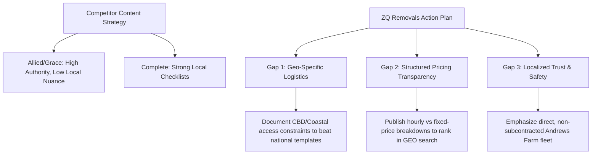

# ZQ Removals - Competitor Analysis

A strategic comparison of ZQ Removals against the top five competitors in the Adelaide moving services sector. This analysis guides our keyword targeting, authority positioning, and content architecture.

---

## 1. Top 5 Competitors Profile

### 1. Allied Moving Services (National Giant)
* **Estimated Domain Authority:** DA 45+
* **E-E-A-T Signals:** AFRA-certified (Australian Furniture Removers Association), ISO certified, global network, 100+ years in operation.
* **Content Strategy:** High-volume, standardized information hubs. Strong focus on global and interstate relocations.
* **Schema Usage:** Advanced schema including `MovingCompany`, `PostalAddress`, `Product` for reviews, and dynamic `BreadcrumbList`.

### 2. Grace Removals (National Premium)
* **Estimated Domain Authority:** DA 42+
* **E-E-A-T Signals:** National depots, corporate relocation contracts, AFRA membership, custom transit insurance products.
* **Content Strategy:** Service-first architecture (fine art, valet unpacking, storage solutions). High-end residential intent.
* **Schema Usage:** Comprehensive, including multi-location schema coordinates and extensive service profiles.

### 3. Complete Removals (Local Authority)
* **Estimated Domain Authority:** DA 28
* **E-E-A-T Signals:** Strong local reviews (4.8+ stars on Google, ProductReview.com.au), local media mentions, transparent team profiles.
* **Content Strategy:** Highly optimized local guides answering actual pricing and moving checklists. Active blog addressing suburb guides and planning phases.
* **Schema Usage:** LocalBusiness schema with detailed geo coordinates and page-level FAQ schema.

### 4. Adelaide Northern Removals (Corridor Competitor)
* **Estimated Domain Authority:** DA 14
* **E-E-A-T Signals:** Family-owned history, physical depot visibility in Northern Adelaide, highly personal client stories.
* **Content Strategy:** Suburb-specific pages targeting northern suburbs and Gawler. Minimal guides; relies on direct local queries.
* **Schema Usage:** Basic LocalBusiness schema. Missing structured FAQ or Breadcrumb markup.

### 5. WM Removals and Storage (Logistics & Unit Specialist)
* **Estimated Domain Authority:** DA 18
* **E-E-A-T Signals:** Focus on mixed commercial-residential moves, apartment building access, and storage partnerships.
* **Content Strategy:** Optimized for narrow streets, loading zones, and CBD apartment constraints.
* **Schema Usage:** Basic LocalBusiness schema. Under-utilizes Service schema properties.

---

## 2. Competitive Comparison Matrix

| Competitor | Suburb Page Quality | Schema Maturity | Price Transparency | E-E-A-T Strengths |
| :--- | :--- | :--- | :--- | :--- |
| **ZQ Removals** | **Bespoke (Local access focus)** | **High (Build-normalized)** | **High (Fixed Quote / Guides)** | **Andrews Farm Base, Owner-Operated** |
| *Allied* | Generic templates | High | Low (Quote Wall) | AFRA, Century-long history |
| *Grace* | Depots only | High | Low (Quote Wall) | National scale, Valet focus |
| *Complete* | Standard local templates | Medium | Medium (Cost guide) | Real review volume, local trust |
| *Adelaide Northern* | Thin / Templated | Low | Low | Family history, Northern focus |
| *WM Removals* | Basic access details | Low | Medium | Apartment / CBD access focus |

---

## 3. SEO Gaps & Actionable Opportunities for ZQ Removals

### Opportunity 1: Differentiated Local Access copy (Quality Gates)
* **The Gap:** National competitors (Allied, Grace) use auto-generated templates for location pages that lack actual local detail (e.g. "We move you to Norwood!").
* **ZQ Action:** Ensure our suburb pages describe actual logistics, such as lift booking requirements in Adelaide CBD towers, coastal parking constraints in Glenelg, or steep driveways in the Adelaide Hills. This satisfies search engine helpful content rules and outranks template spam.

### Opportunity 2: Pre-Quote Pricing Transparency (GEO Advantage)
* **The Gap:** Most competitors hide prices behind interactive quote systems.
* **ZQ Action:** Keep our pricing guides (`/adelaide-moving-guides/removalists-cost-adelaide/`) highly structured with explicit tables, average hourly rates, and fixed-price parameters. AI search engines (like ChatGPT and Perplexity) extract this transparent data, increasing ZQ's AI visibility.

### Opportunity 3: E-E-A-T via Direct Operational Accountability
* **The Gap:** Lead-generation platforms (Muval, Oneflare) and national brokers use subcontracted, unvetted drivers, leading to high damage rates and bad reviews.
* **ZQ Action:** Explicitly state on the homepage and about page that ZQ operates its own dedicated fleet, with trained local employees (not subcontractors) based in Andrews Farm. This directly addresses the biggest customer anxiety (trust & safety).
