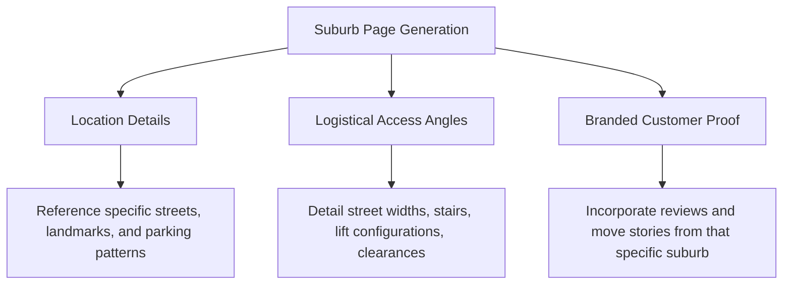

# ZQ Removals - Content Calendar

A strategic, phased content plan focusing on capturing high-intent commercial keywords, addressing customer anxieties before they request a quote, and establishing E-E-A-T credentials.

---

## 1. Content Gaps & Focus Areas

* **Informational Intent:** Guides helping users prepare for moves, which feed directly into commercial pages (e.g. apartment packing timelines, CBD parking permit guides).
* **Commercial Intent:** Highly specialized service + suburb pages that address local logistics (e.g., "Norwood packing services", "Adelaide CBD office removals").
* **Trust & Safety (E-E-A-T) Copy:** Original photography guidelines, team profiles, insurance checklists, and equipment specifications.

---

## 2. E-E-A-T Building Plan

To distinguish ZQ Removals from unvetted broker platforms:
1. **Physical Asset Highlight:** Integrate high-quality photos of ZQ trucks, branded uniforms, and packing materials. Avoid AI-generated images.
2. **Local Depot Profile:** Feature a dedicated section showing the base in Andrews Farm, servicing the northern corridor down to the southern hubs.
3. **Move Coordinator Profiles:** Author tags on guide articles written by real operations managers showing industry experience.
4. **Transparent Insurance Guides:** Clear, non-deceptive documentation of carrier liability and coverage parameters (`/insurance-and-coverage/`).

---

## 3. 6-Month Content Roadmap (Table)

| Month / Phase | Target Page Type | Topic / Target Title | Key Target Keyword(s) | E-E-A-T Trust Signal Included |
| :--- | :--- | :--- | :--- | :--- |
| **Month 1: Foundation** | Service Page | House Removals Adelaide | house removals adelaide, local house movers | Andrews Farm depot photos, family-owned badge |
| **Month 1: Foundation** | Service Page | Office Removals Adelaide | office removals adelaide, commercial movers | Business registration detail, commercial equipment list |
| **Month 2: Expansion** | Suburb Landing | Removalists Mawson Lakes | removalists mawson lakes, mawson lakes movers | Local unit loading zone info, lake corridor parking tips |
| **Month 2: Expansion** | Suburb Landing | Removalists Glenelg | removalists glenelg, glenelg beachside movers | Coastal access logistics, multi-story stairs protocols |
| **Month 3: Expansion** | Suburb Landing | Removalists Adelaide CBD | removalists adelaide cbd, adelaide city movers | Lift booking requirements, loading dock clearance data |
| **Month 3: Informational**| Planning Guide | Preparing an Apartment Move in Adelaide | apartment moves adelaide, lift booking checklist | Interactive lift booking timeline, key contact points |
| **Month 4: GEO Boost** | Informational | How to Scope a Commercial Office Move | office move planning adelaide, office relocations | Building access check sheet (stairs vs lifts) |
| **Month 4: GEO Boost** | Planning Guide | The Complete Box & Packing Materials Scoper| packing materials adelaide, packing boxes | Original photos of packing cartons, fragile wrap instructions |
| **Month 5: Scale** | Suburb Landing | Removalists Salisbury | removalists salisbury, salisbury removal services | Focus on family home inventory and garage packing |
| **Month 5: Scale** | Suburb Landing | Removalists Elizabeth | removalists elizabeth, elizabeth removalist company | Local corridor logistics, same-day scheduling availability |
| **Month 6: Authority** | Informational | Interstate Removals: Adelaide to Melbourne | adelaide to melbourne removalists, backloading | Detail on depot-to-depot transit safety, security seals |
| **Month 6: Authority** | Informational | Interstate Removals: Adelaide to Sydney | adelaide to sydney removalists, interstate moves | Details on transit timing, NSW boundary compliance |

---

## 4. Suburb Page Content Quality Framework

To satisfy the unique content threshold (minimum 40% uniqueness per location page):

### Logistical Access Rules:
* **Adelaide CBD:** Must mention loading dock height limits, parking permits from Adelaide City Council, and lift key deposits.
* **Glenelg / Coastal:** Must mention beachside parking pressure, narrow laneways, and wind/moisture protection for furniture.
* **Adelaide Hills / Blackwood:** Must mention steep driveways, tree clearance for large trucks, and tight turning circles.
* **Andrews Farm / Salisbury:** Must mention larger family home inventories, garage items, and highway access corridors.
