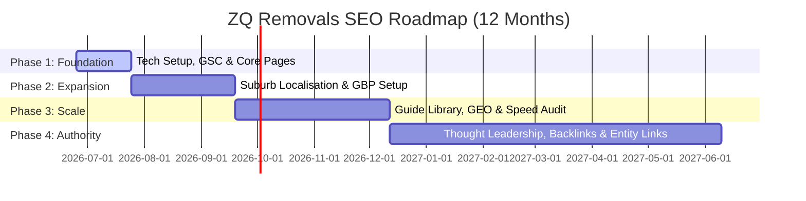

# ZQ Removals - SEO Implementation Roadmap

A phased, 12-month action plan outlining the execution steps required to achieve the targets in the ZQ Removals SEO Strategy.

---

## 1. Timeline Overview

---

## 2. Phase Details

### Phase 1: Foundation (Weeks 1-4)
*Objective: Build the technical core, verify tracking pipelines, and ensure sitemap cleanliness.*

* **Task 1.1: Verify GSC and DNS Ownership**
  * Verify the domain property `zqremovals.au` in Google Search Console using DNS TXT records.
  * Submit the production sitemap `/sitemap.xml` and monitor initial crawl logs.
* **Task 1.2: Core Pages Audit & Rewrite**
  * Confirm homepage hero, services summaries, and `/about/` page copies are locked and aligned to search objectives (careful handling, direct pricing, Andrews Farm fleet).
* **Task 1.3: Normalised Schema Verification**
  * Validate JSON-LD generation on build. Confirm `MovingCompany` schema contains correct `telephone` (`0433 819 989`), `address` (Andrews Farm), and consistent `@id` identifiers.
  * Check that `BreadcrumbList` matches visible navigation without errors.
* **Task 1.4: Conversion & Attribution Smoke Test**
  * Smoke test the `/contact-us/` page Web3Forms submission path. Confirm GA event triggers (`generate_lead`) fire successfully and attribution tags pass properly.

---

### Phase 2: Expansion (Weeks 5-12)
*Objective: Scale geographic corridor coverage and maximize Google Business Profile local pack footprint.*

* **Task 2.1: Google Business Profile (GBP) Optimisation**
  * Complete video verification demonstrating physical truck ownership, Andrews Farm base, and moving tools.
  * Configure WhatsApp Business channel as the primary contact chat link on GBP.
  * Ensure business hours are accurate (and extended if feasible) as a high-weight local ranking factor.
* **Task 2.2: Suburb Page Localisation Sprint**
  * Review all 100+ generated suburb pages. Ensure the primary location hubs (Adelaide CBD, Glenelg, Marion, Salisbury, Elizabeth) meet unique content thresholds (min 40% unique copy).
  * Add bespoke logistical access copy (narrow lanes, lift booking times, parking permits) to Norwood, Mawson Lakes, and Prospect pages.
* **Task 2.3: Local Directory Co-Citation Campaign**
  * Submit ZQ Removals to high-trust Australian local directories (Yelp, YellowPages, TrueLocal, WordOfMouth) with exact Name, Address, Phone (NAP) match.

---

### Phase 3: Scale (Weeks 13-24)
*Objective: Capture informational planning searches via guides, optimize for AI search (GEO), and maximize page speed.*

* **Task 3.1: Launch Planning Guides Library**
  * Publish guides covering pre-quote logistics: apartment move lift guidelines, weekend vs weekday costs, packing timelines.
  * Embed clear calls-to-action (CTAs) directing guide readers to `/contact-us/#quote-form`.
* **Task 3.2: GEO Optimization Pass**
  * Publish structured pricing tables in `/adelaide-moving-guides/removalists-cost-adelaide/`.
  * Structure frequently asked questions in a clear Q&A format.
* **Task 3.3: Core Web Vitals Audit**
  * Run Lighthouse / LHCI speed audits.
  * Optimize media dimensions (like hero WebP at 768x406) and minify critical CSS to pass mobile Core Web Vitals checks.

---

### Phase 4: Authority (Months 7-12)
*Objective: Build off-site domain authority and establish entity recognition.*

* **Task 4.1: Brand Mentions & Curated Lists Outreach**
  * Pitch ZQ Removals for inclusion in local "Best Removalists in Adelaide" blog articles and community directories.
* **Task 4.2: Structured Review Stories Program**
  * Implement an automated customer feedback loop prompting clients for reviews containing photo uploads of ZQ trucks/crews in their specific suburbs.
* **Task 4.3: Advanced Semantic Entity Linking**
  * Map ZQ Removals' areas served in schema to Wikidata/DBpedia entities for Adelaide, Andrews Farm, and South Australia to build strong knowledge graph connections.
