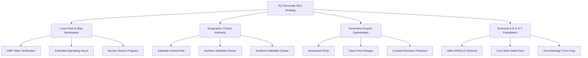

# ZQ Removals - Strategic SEO Plan

This strategic plan establishes the long-term SEO direction for **ZQ Removals** (`https://zqremovalsadelaide.com.au`), Adelaide’s premier local and interstate relocation service. By combining local SEO authority, geographic cluster mapping, and Generative Engine Optimization (GEO), this strategy is designed to capture high-intent commercial search traffic and drive pre-quote conversions.

---

## 1. Discovery & Business Background

### Business Profile & Service Coverage
* **Entity Name:** ZQ Removals
* **Operational Base:** Andrews Farm, South Australia (Northern Adelaide)
* **Target Segments:** Residential households, office/commercial relocations, furniture removals, heavy/bulky items, and packing services.
* **Geographical Coverage:** 
  * **Local:** Greater Adelaide (Adelaide Metro, Northern Adelaide, Southern Adelaide, Adelaide Hills, Coastal regions like Glenelg).
  * **Interstate Routes:** Key transport corridors connecting Adelaide to Melbourne, Sydney, Western Sydney, Smithfield NSW, Brisbane, Canberra, Perth, and Queensland.

### Primary Conversion Action
The primary business objective is capturing detailed, high-intent move details through the online quote form (`/contact-us/#quote-form` or `/contact-us/`) powered by the Web3Forms API, routing leads directly to booking coordinators. A secondary call-to-action focuses on direct phone consultations (`0433 819 989`).

### Core SEO Challenges
1. **Intense Local Competitiveness:** The Adelaide removals landscape is crowded, with competitors utilizing broad aggregators (e.g., Muval, Oneflare) and automated location page networks.
2. **Quality Gate vs. Suburb Volume:** Balancing the need for hyper-local search coverage (for over 100 suburbs) with search engine guidelines that penalize duplicate, thin location pages.
3. **E-E-A-T Enforcement:** Distinguishing the business from unregistered "two guys and a truck" operations by emphasizing operational safety, careful handling protocols, and genuine customer feedback.

---

## 2. Industry Characteristics & Search Psychology

Local moving services operate under a distinct search footprint:

* **Geographic Intent:** Over 90% of searches contain a suburb name, post/ZIP code, or "near me" modifiers (e.g., "removalists marions", "office movers Adelaide CBD").
* **High Urgency & Fast Decisions:** Movers generally research pricing and book within a 2-4 week window of their target date. Content must be structured to immediately answer logistics and pricing questions.
* **Mobile-First Footprint:** Over 70% of local searches are performed on mobile devices. Fast page load times and mobile-friendly quote forms are critical to prevent exit rates.
* **Trust & Damage Mitigation:** The primary user anxiety is damage to personal property and hidden fees. High-impact content must address these objections directly.

---

## 3. SEO Strategic Pillars

Our plan is structured around four core pillars:

### Pillar 1: Local Pack & Map Domination
Optimizing the Google Business Profile (GBP) listing as the primary high-converting channel.
* **Operational Shift:** Prepare for GBP video verification requirements showing the physical truck fleet, equipment, and Andrews Farm base.
* **Ranking Factors:** Keep business hours updated and accurate; align website service details to GBP services.
* **WhatsApp Integration:** Bridge the deprecation of Google Business Chat by linking a dedicated WhatsApp Business contact channel.

### Pillar 2: Geographic Cluster Authority
Strengthening topical authority through local hub-and-spoke grouping:
* **The Hubs:** Adelaide Central Hub, Southern Adelaide Corridor, Northern Adelaide Hub.
* **Spokes:** Specific, differentiated suburb landing pages linking back to their corresponding regional hub and core commercial service pages.
* **Quality Rule:** Every suburb page must contain localized access angles (loading zones, stairs, gate clearances) to satisfy search engine unique content requirements.

### Pillar 3: Generative Engine Optimization (GEO)
Preparing the site for AI search visibility (ChatGPT Search, Perplexity, Google AI Overviews):
* **Price Transparency:** Publish explicit, transparent pricing models and ranges (e.g., in `/adelaide-moving-guides/removalists-cost-adelaide/`) to feed AI extraction models.
* **Structured FAQs:** Utilize Q&A formats that address complex situational queries (e.g., moving in bad weather, apartment lift keys).
* **Directory Co-Citation:** Build high-trust links from local business listings and curated "best of" lists that AI models cite.

### Pillar 4: Technical & E-E-A-T Foundation
Maintaining absolute technical cleanliness and brand trust:
* **Host Consistency:** Strict enforcement of the apex domain (`https://zqremovalsadelaide.com.au`) across sitemaps, canonicals, and redirects.
* **Schema Integrity:** Automatic JSON-LD synchronization to page metadata to prevent developer drift.
* **Trust Safeguards:** Zero fake reviews, zero fake ratings, and clear documentation of operational safety protocols.

---

## 4. Key Performance Indicators (KPIs)

To measure the success of this strategy, we will track the following metrics over a 12-month timeline:

| Metric | Baseline | 3 Month Target | 6 Month Target | 12 Month Target |
| :--- | :--- | :--- | :--- | :--- |
| **Organic Traffic** | 250 visits/mo | 400 visits/mo | 750 visits/mo | 1,500 visits/mo |
| **GBP Impressions** | 1,200/mo | 1,800/mo | 3,000/mo | 6,000/mo |
| **Quote Submissions** | 15/mo | 30/mo | 60/mo | 120/mo |
| **Local Pack Visibility** | Top 10 | Top 5 (Core Suburbs) | Top 3 (Adelaide North) | Top 3 (Metro Adelaide) |
| **Core Web Vitals** | Passing (Desktop) | Passing (Mobile) | Maintained | Maintained |
| **Domain Authority (Est)**| DA 8 | DA 12 | DA 18 | DA 25 |

---

## 5. Success Criteria & Quality Gates

* **Zero Duplication:** Suburb pages must maintain a minimum of 40% unique local copy (describing streets, apartment profiles, traffic, corridors). Suburbs with thin content must be merged or redirected.
* **Sitemap Cleanliness:** The sitemap must contain only indexable pages. No 404s, no concept concepts, and no legacy alias redirects.
* **Host Policies:** Every generated page must strictly serve the `https://zqremovalsadelaide.com.au` host in its canonical tag and open graph metadata.
