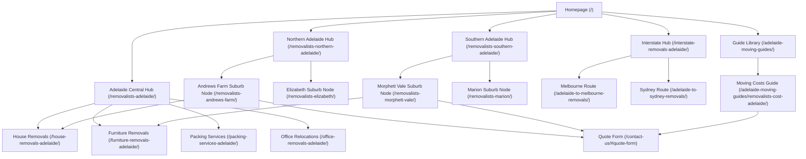

# ZQ Removals - Site Structure & Architecture Design

This document outlines the URL directory architecture, sitemap rules, redirect policies, and structural quality gates for the **ZQ Removals** static website generator (`https://zqremovals.au`). It acts as a guide for ensuring crawl hygiene, cluster strength, and technical SEO compliance across all future updates.

---

## 1. URL Hierarchy & Directory Layout

The website uses a structured, flat URL layout for public pages, mapping cleanly to specific search intents. The static site generator output paths map to clean URLs using trailing slashes.

### URL Structure Table

| Category | URL Path Pattern | Content Source | Primary Intent | Robots Index Policy |
| :--- | :--- | :--- | :--- | :--- |
| **Core Home** | `/` | `content/index.html` | Brand search, Hub entry | `index,follow` |
| **Service Cluster** | `/removalists-adelaide/` | `content/removalists-adelaide/` | Metro Adelaide commercial | `index,follow` |
| **Service Spoke** | `/[service]-removals-adelaide/` | `content/[service]-removals-adelaide/` | Niche commercial queries | `index,follow` |
| **Suburb Spoke** | `/removalists-[suburb]/` | `content/removalists-[suburb]/` | Hyper-local commercial | `index,follow` |
| **Interstate Hub** | `/interstate-removals-adelaide/` | `content/interstate-removals-adelaide/` | Broad interstate search | `index,follow` |
| **Interstate Route** | `/adelaide-to-[city]-removals/` | `content/adelaide-to-[city]-removals/` | Corridor specific queries | `index,follow` |
| **Guide Hub** | `/adelaide-moving-guides/` | `content/adelaide-moving-guides/` | Pre-quote informational | `index,follow` |
| **Guide Spoke** | `/adelaide-moving-guides/[slug]/` | `content/adelaide-moving-guides/[slug]/` | Target long-tail questions | `index,follow` |
| **Utility** | `/contact-us/`, `/about/` | `content/contact-us/`, `content/about/` | Trust, lead submission | `index,follow` |
| **Redirects** | `/legacy-slug.html` or `/slug/` | `content/legacy-redirects/` | Retain historical crawl equity | `noindex,nofollow` |

---

## 2. Internal Linking Flow & Cluster Map

The site is built as a strict hierarchical cluster network to guide search engines and flow link equity down from high-level pages to deep suburb nodes, and back up to money pages.

### Navigation and Linking Map

### Linking Standards Checklist
* **Hub-to-Spoke Linkage:** Every regional hub must link directly to all subordinate suburb nodes.
* **Upward Flow:** Every suburb node must link back to its parent regional hub (e.g., `/removalists-andrews-farm/` linking to `/removalists-northern-adelaide/`) and at least one core service page.
* **Orphan Protection:** No suburb or guide page may exist without being linked from its respective parent registry in `site-src/pages.json` and a hub layout element.
* **Anchor Text Diversity:** Avoid exact-match anchor stuffing. Use natural, descriptive variations (e.g., "Andrews Farm removalists" instead of repeating "removalist Andrews Farm" 5 times on a page).

---

## 3. Site Structure Quality Gates

To protect the crawling budget and site indexing health, future developers and content creators must respect the following **Quality Gates**:

### Suburb & Location Page Gating

> [!IMPORTANT]
> To prevent "crawler bloating" and negative indexing reviews due to programmatic duplication, location page counts are capped.

* **Hard Page Limits:**
  * **Warning Threshold:** 30 suburb pages. Once 30 location pages are registered, the team must review crawl data and indexing performance.
  * **Absolute Cap:** 50 suburb pages. No more than 50 suburb pages may be generated without an explicit indexing audit showing high conversion metrics.
* **Content Uniqueness Minimum:**
  * Every location page must have **at least 40% unique copy**.
  * Dynamic variables (suburb name, postcode) do not count toward this 40% uniqueness requirement.
  * Copy must focus on specific local constraints: apartment lift availability, stair-well dynamics, loading zones, tight streets, or transit corridor timings (e.g., traffic delays during peak hour on South Road for southern suburbs).
* **Audit on Fail:** If a suburb page has thin or template-duplicated copy, it must be deleted or permanently redirected to its parent hub page, and excluded from `sitemap.xml`.

---

## 4. Sitemap Inclusion Policy

`sitemap.xml` is automatically built by the generator script (`scripts/build-site.mjs`) during compilation. Pages are allowed in `sitemap.xml` **ONLY** when they meet all of the following criteria:

* **Intent:** Page is explicitly meant to be public and indexable.
* **Robots Rule:** Page does not contain a `noindex` tag.
* **Layout Rule:** Page uses the `standard` layout (not `redirect` or `bare`).
* **Canonical Match:** Page's canonical URL matches the target URL exactly on the host `https://zqremovals.au` (including trailing slashes).
* **Utility Exclusions:** Specifically exclude the following files from the sitemap:
  * `404.html`
  * `thank-you.html` (or equivalent post-submit target)
  * Any preview, draft, or concept routes located under `premium-moving-concepts/`
  * All legacy redirect URL entries

---

## 5. Redirect & Canonical Host Enforcement

### Canonical Apex Domain Rule

The apex domain **MUST** be used as the absolute canonical host. The generator forces this behavior across all generated elements.

> [!CAUTION]
> Never mix `www.zqremovals.au` and `zqremovals.au` in HTML metadata or sitemaps. Mixed targets trigger duplicate content penalties in modern search engines.

* **Host Value:** `https://zqremovals.au`
* **Coverage:** Canonical tags, `og:url`, JSON-LD `@id` elements, sitemap `<loc>` tags, social share image paths, and internal absolute hrefs.
* **Trailing Slash:** All canonical links to page folders must contain a trailing slash (e.g., `https://zqremovals.au/removalists-adelaide-cbd/`).

### Redirect Mapping Mappings (Legacy URLs)

The generator registers explicit redirects in `site-src/pages.json` using the `"layout": "redirect"` attribute, generating metadata refreshing layout code to forward the crawler.

* **Redirect Target Rule:** Redirect targets must point to the canonical URL of the live page with a trailing slash where appropriate.
* **Robots Rule for Redirects:** Redirect pages in `pages.json` must be set to `noindex,nofollow` to ensure Google updates its index rapidly.
* **Sitemap Rule for Redirects:** Redirect URLs must never appear in `sitemap.xml`.

#### Verified Redirect Mappings

| Legacy Crawled URL | Target Canonical URL | Purpose |
| :--- | :--- | :--- |
| `/adelaide-cbd.html` | `/removalists-adelaide-cbd/` | Legacy HTML alias consolidation |
| `/privacy.html` | `/privacy-policy/` | Policy file structure alignment |
| `/privacy/` | `/privacy-policy/` | Slash/folder syntax consolidation |
| `/terms.html` | `/terms-and-conditions/` | Policy file structure alignment |
| `/terms/` | `/terms-and-conditions/` | Slash/folder syntax consolidation |
| `/interstate-removalists-adelaide/` | `/interstate-removals-adelaide/` | Alias target consolidation (Removals vs. Removalists) |
